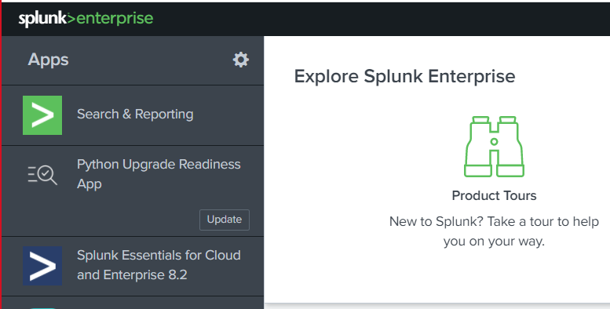
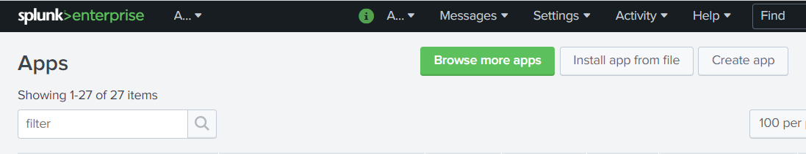
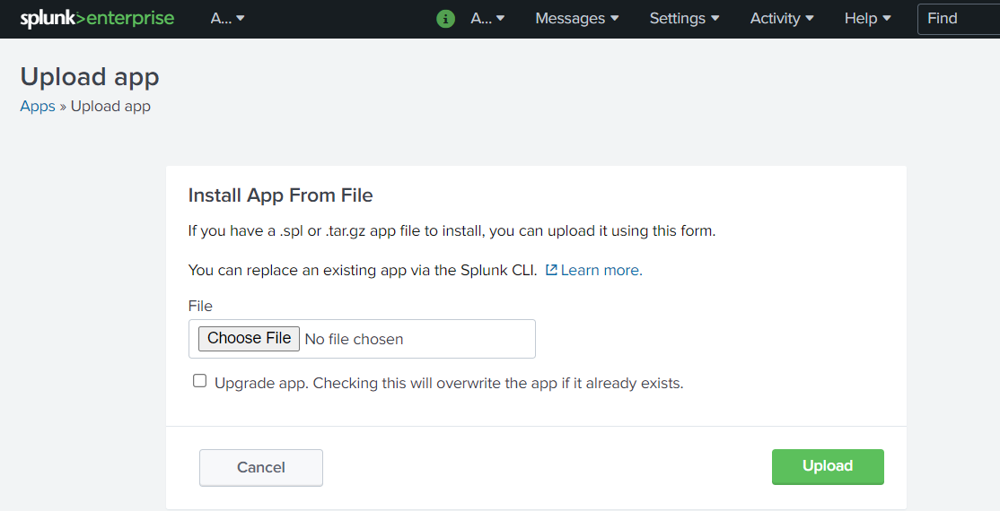
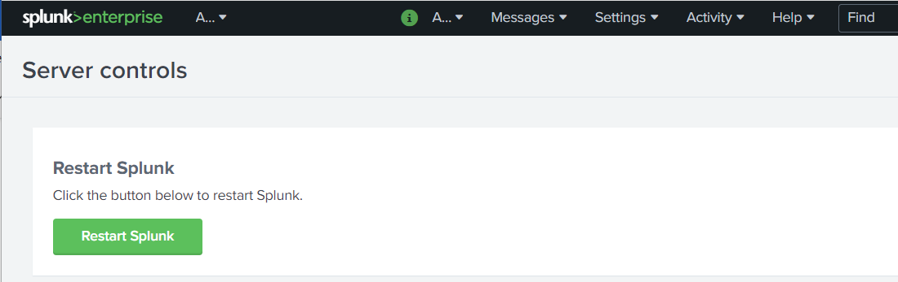
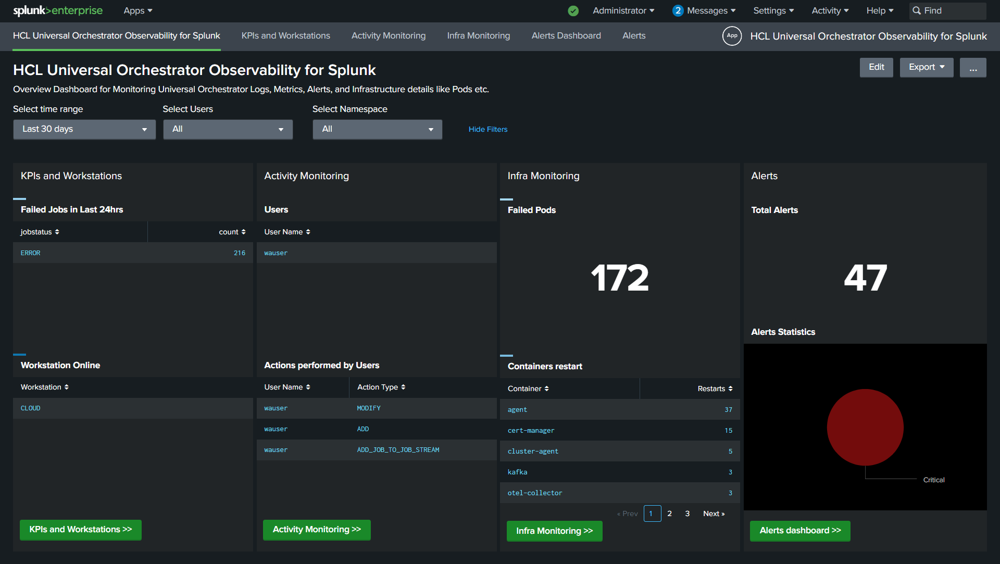
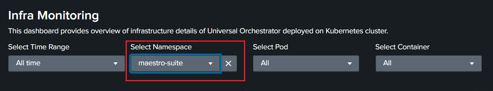

# HCL Universal Orchestrator Observability for Splunk

You can use HCL Universal Orchestrator (UnO) Observability for Splunk to monitor HCL Universal Orchestrator metrics, events, audit and infrastructure logs.

## Content
- [HCL Universal Orchestrator Observability for Splunk](#hcl-universal-orchestrator-observability-for-splunk)
  - [Content](#content)
- [Prerequisites](#prerequisites)
- [Language support](#language-support)
- [Installation](#installation)
    - [1. Installing and Configuring Splunk](#1-installing-and-configuring-splunk) 
    - [2. Splunk installation](#2-splunk-installation)
      - [a. Install or Import UnO Monitoring App in Splunk](#a-installimport-uno-monitoring-app-in-splunk)
      - [b. Create HEC Token](#b-create-hec-token)
    - [3. Splunk Otel Collector for Kubernetes](#3-splunk-otel-collector-for-kubernetes)
      - [a. Configuration for GKE cluster](#a-configuration-for-gke-cluster)
- [Getting Started with Universal Orchestrator Monitoring App](#getting-started-with-universal-orchestrator-monitoring-app)
- [FAQs](#faqs)

## Prerequisites
Following pre-requisites must be satisfied prior to deploy the Splunk solution: 
- Kubernetes cluster (GKE) with administrative access
- UnO v1.1 installed on the Kubernetes cluster (GKE)
- Tools & Packages 
  - [Helm3](https://helm.sh/docs/intro/install/)
  - [Splunk OpenTelemetry Collector for Kubernetes](https://github.com/signalfx/splunk-otel-collector-chart) 

## Language support
For the dashboards provided with UnO Observability for Splunk, the only supported language is English. 

## Installation


### 1. Installing and Configuring Splunk
1. From [HCL License Portal](https://id.hcltechsw.com/login/login.htm) download the appropriate HCL Universal Orchestrator Observability installation package:
   Universal Orchestrator for UnO Observability Add-on
   
2.  Installation package for Splunk: UNO_OBSERVABILITY_APP_FOR_SPLUNK_1.1.0.0.tar.gz

3. Follow the below command to untar the gzip file 
  
  ```
   tar -xvzf UNO_OBSERVABILITY_APP_FOR_SPLUNK_1.1.0.0.tar.gz
  ```

4. Follow the steps mentioned on this ReadMe file to complete the solution setup.

### 2. Splunk installation
Splunk can be deployed on Kubernetes by using official [Splunk Operator for Kubernetes](https://github.com/splunk/splunk-operator/blob/master/docs/README.md). Follow the steps mentioned in Splunk official documentation to setup Splunk by using Splunk Operator.

#### a. Install/Import UnO Monitoring App in Splunk 

UnO monitoring application is available as .spl file. 

Importing application steps: 
- Installing the UnO Monitoring App 
  - Go to the Splunk console’s home page by navigating to http://servername:8000 in your browser
  - Click on the gear icon:
  
    
  - Click Install app from file: 
    
  - Browse uno_monitoring_app.spl file and click Upload:
    
  - Click Settings > Server controls > Restart Splunk: 
    

For more information about installing app from file, refer to [Splunk documentation](https://docs.splunk.com/Documentation/AddOns/released/Overview/Singleserverinstall).
  
 
#### b. Create HEC Token
- The HEC Token for this application was `uno_hec_token` , if you need to create a new HEC Token follow the below steps.
- Create an HEC token in Splunk following the steps listed in this [documentation](https://docs.splunk.com/Documentation/Splunk/9.0.1/Data/UsetheHTTPEventCollector#Configure_HTTP_Event_Collector_on_Splunk_Enterprise).
- Configure HEC token to send data to "uno-logs" index.
  >- Select "Settings"
  >- Go to "Data Inputs"
  >- Select "HTTP Event Collector"
  >- Edit HEC token which you just created.
  >- Among the allowed indexes, select "uno-metrics" and "uno-logs".
  >- Save it.

NOTE : if you have selected `Enable SSL` in Global Settings , use HTTPS for HEC endpoint.	

### 3. Splunk Otel Collector for Kubernetes
Follow the below steps and install Splunk OpenTelemetry Collector for Kubernetes on your Kubernetes cluster. 

  
#### a. Configuration for GKE cluster
1. Add the following Helm repo
```
helm repo add splunk-otel-collector-chart https://signalfx.github.io/splunk-otel-collector-chart
```
2. Follow this [Pod Security Policy](https://github.com/signalfx/splunk-otel-collector-chart/blob/main/docs/advanced-configuration.md#manually-setting-pod-security-policy) documentation and run the step 1.

3. To install the Splunk OpenTelemetry Collector in a Kubernetes cluster, the splunkPlatform must be configured.
  Download and update the below steps in the [values.yaml](https://github.com/signalfx/splunk-otel-collector-chart/blob/main/helm-charts/splunk-otel-collector/values.yaml) file.

4. Prepare this Values file. Provide the following inputs to the variables:

| Variable name	 | Input to be given|
| ------ | ------ |
| clusterName	 | your clusterName |
| splunkPlatform.endpoint	 | your HEC endpoint |
| splunkPlatform.token	 | value of your HEC token|
| splunkPlatform.index  |	uno-logs |
| splunkPlatform.metricsIndex |	uno-metrics |
| splunkPlatform.insecureSkipVerify  |	true |
| splunkPlatform.logsEnabled  |	true |
| splunkPlatform.metricsEnabled  |	true |
| cloudProvider  |	gcp |
| distribution  |	gke |
| autodetect.prometheus  |	true |
| autodetect.istio  |	true |


5. Replace your agent.config with below config

```
config:           
    receivers:
      receiver_creator:
        watch_observers: [k8s_observer]
        receivers:
          prometheus_simple:
            rule: type == "pod" && annotations["prometheus.io/scrape"] == "true"
            config:
              endpoint: '`endpoint`:`8443`'
              metrics_path: '/q/metrics'
              collection_interval: 30s
              use_service_account: false
              tls:
                insecure: false
                insecure_skip_verify: true

```

6. Replace your logsCollection.containers.excludePaths with below excludePaths

```
 excludePaths: ["/var/log/pods/*/*/*.log"]

```

7. Replace your fluentd.config.path with below path

```
  path: /var/log/containers/*audit-log-sidecar*.log

```
8. Add the following custom ClusterRole rule in your values.yaml file along with all other required fields like clusterName, splunkPlatform.(Add this section at the bottom of the yaml file.)

```
  rbac:
    customRules:
      - apiGroups:     [extensions]
        resources:     [podsecuritypolicies]
        verbs:         [use]
        resourceNames: [splunk-otel-collector-psp]

```
9. Run the below command.

```
helm install my-splunk-otel-collector --values values.yaml splunk-otel-collector-chart/splunk-otel-collector
```

## Getting Started with Universal Orchestrator Monitoring App
The UnO Monitoring overview dashboard provides a single, consolidated view for monitoring the workload status. By selecting the dashboard in the list, you can see the information related to that dashboard. 

HCL Universal Orchestrator Observability for Splunk

In the UnO Monitoring **Overview Dashboard**, you can view the whole status of your workload at a glance for one or more of the engines you have configured.  

Overview Dashboard: 
 

By clicking a button or menu option, you open a new tab displaying the selected dashboard information. The following dashboards are supported: 

- **KPIs and Workstations**. This dashboard shows the Universal Orchestrator KPIs information for each host and allows drilldown to see the timeseries data in visual representation for defined KPIs.

  Source of Information: API exposed by all the pods on port 8443.
   
- **Activity Monitoring**. This dashboard shows details of workstations and audit information such as user actions. Users can view audit information for selected time range, user and object. 

  Source of Information:  UnO sidecar audit containers, for example: audit-log-sidecar. 

- **Infra Monitoring**. This dashboard provides an overview of the infrastructure details of Universal Orchestrator deployed on Kubernetes cluster. Filter by your Kubernetes namespace and view the dashboard as shown below:
 
  Source of Information: Infrastructure Logs exposed by Kubernetes cluster. 

- **Alerts Dashboard**. The UnO monitoring application comes with predefined alerts configured as an example. Users can navigate to alerts page and easily enable/disable these alerts when needed. The statistical reports and graphical visualizations of the alerts created for UnO application can be viewed in UnO Alerts dashboard. Follow this [Splunk documentation](https://docs.splunk.com/Documentation/Splunk/8.2.4/Analytics/Alerts) to manage alerts (create new, enable & disable etc...). in Splunk application.
Follow this [Splunk documentation](https://docs.splunk.com/Documentation/Splunk/8.2.4/Alert/Emailnotification)  to configure the email setting in Splunk application.

The following table shows some of the out-of-the-box alert definitions that come with the UnO Monitoring Application:
| Monitor Name	| Severity | Trigger Condition |
| ------ | ------ | ------ |
| Uno_Agent_Linked	| Critical | ==0 (more than 5 minutes) |


**Note: By default, all the above alerts are disabled. You need to enable them based on your requirements.**
 
## FAQs 
1. Q: What are the supported platforms for HCL Universal Orchestrator Observability for Splunk ?
  
   A: The solution can be deployed on Kubernetes cluster (GKE) with administrative access. 
2. Q: Where can I find the installation procedure details? 
   
   A: Installation steps are provided in this document. Also provided external links wherever applicable. 
3. Q: Which Splunk product is supported? Splunk Enterprise, Splunk Cloud, or Splunk Observability? 
   
   A: This solution can be deployed on Splunk Enterprise trial version 9.0.x.
4. Q: What are the indexes required by UNO Monitoring Splunk App? 
   
   A: UNO Monitoring App utilizes 2 indexes: ***uno-logs*** and ***uno-metrics***. 

5. Q: How to increase the size of Splunk OTel Collector containers?

   A: Follow this [Sizing Splunk OTel collector containers](
https://github.com/signalfx/splunk-otel-collector-chart/blob/main/docs/troubleshooting.md#sizing-splunk-otel-collector-containers) documentation.

6. Q: How to troubleshoot the Splunk OTel Collector?

   A: Follow this [Splunk OpenTelemetry Collector troubleshooting ](https://github.com/signalfx/splunk-otel-collector-chart/blob/main/docs/troubleshooting.md) documentation.
   
7. Q: Error in 'mpreview' command: This command is not supported in a real-time search?
  
    A: Apply Relative times in Time Range filter. 

8. Q:  Where I can find infrastructure details of Failed Pods?
   
   A: The Failed Pods details can be found in the Infra Monitoring dashboard. 
    You can navigate to Infra Monitoring dashboard by either selecting menu item or click on 	button from overview page.

9. Q: HCL Universal Orchestrator Observability Dashboard doesn't show infrastructure details of your Kubernetes cluster?

    A: Filter by your Kubernetes namespace and view the infrastructure details.    
    
10. Q: What insight is available about different audit types? 
   
     A: You can view the details of audit type and its insight in Activity Monitoring dashboard. 
       There are various audit types where user interaction with the system; Database, Plan, Conman, Stageman etc.
       
11. Q: Can I view the generated jobs by category? 
    
    A:  Yes, you can view the generated jobs by category in ***KPIs and Workstations*** dashboard. 	
        You can view the jobs by category like jobs by workstation, jobs by folder, jobs by plan 	count etc.
        
12. Q: Can I view the workstations status? 
 
    A: Yes, you can view the workstation status on ***KPIs and Workstations*** dashboard. 
      Navigate to KPIs and Workstations, see the Online & Linked Workstations section.
      
13. Q: How do I create a new alert?
    
    A: The Splunk documentation provides step by step procedure to create alerts in Splunk. You can follow this [Splunk documentation](https://docs.splunk.com/Documentation/SplunkCloud/8.2.2203/Alert/Definescheduledalerts) to create new alert. For more details, see  [Alert Examples](https://docs.splunk.com/Documentation/Splunk/8.2.4/Alert/Alertexamples).
    
 14. Q: Can I modify/edit existing alerts?
    
    A: Yes, you can modify an existing alert in two ways.
    -  Method 1:
        1.	Select *Alerts* from the top bar of the home page.
        2.	Find the Alert name, click the *Edit* button and edit the alert.
    -  Method 2:
        1.	Select *Alerts Dashboard* from the top bar of the home page.
        2.	Select Alerts Name from the *Alerts* section. A new tab will open.
        
 15. Q: How can I update alert search query?
     
     A:  Splunk documentation provides the steps to update the alert search query. For more details, see this [Splunk documentation](https://docs.splunk.com/Documentation/Splunk/8.2.4/Alert/Alertspage#Edit_an_alert_search)
     
 16. Q: Does Splunk support adding multiple severity for an alert? For example, an alert could be triggered as LOW severity based on some thresholds, and as HIGH severity  based on other thresholds. Can I configure both conditions for the alert? 
    
     A:  No, Splunk does not support adding complex alerts and adding multiple severity for an alert. Alternatively, you can create two different alerts and add the severity based on their conditions. 
  17. Q:  Alerts/Emails are triggered very frequently, sending emails repeatedly. How can I avoid this? 
    
      A: A frequently triggered alert indicates that the alert is configured with a low throttle time (time interval). You can increase the throttle time by editing the alert, selecting the throttle checkbox, and entering *Suppress triggering for* the time interval needed between the subsequent triggers of the alert. For example, if *Suppress triggering for* is set to 1 hour, the alert is triggered every hour.
  
